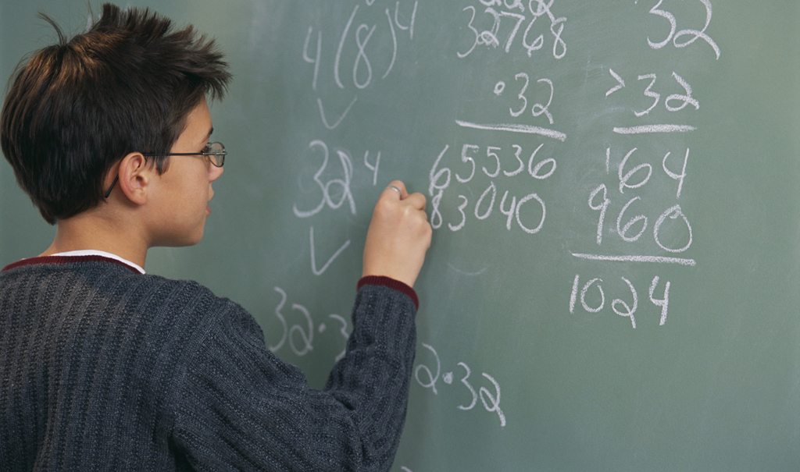

<div align="center">

</div>

<h1 dir="RTL"> 
تمرین سری چهارم: چقدر ریاضی بلدیم و چرا؟
</h1>

<p dir="RTL"> لطفا مقاله زیر را مطالعه بفرمایید. </p>
<p dir="RTL">
[چرایی رتبه ضعیف ایران در آزمون تیمز](https://goo.gl/gX8DZc)
</p>

> <p dir="RTL"> 
با استفاده از داده های ارزیابی تیمز ۲۰۱۵ ادعاهای زیر را مورد ارزیابی قراردهید.
برای هر سوال علاوه بر استدلال آماری که در غالب آزمون فرض تعریف می شود از تصویرسازی مناسب باهر دو ابزار
ggplot2
و
highcharter
استفاده نمایید.
به دلخواه به هفت گزاره از موارد زیر پاسخ دهید.
</p>

```{r base, echo = FALSE}
library(readr)
library(dplyr)
library(tidyr)
library(highcharter)
library(ggplot2)
tims_2015 <- read_rds('~/Desktop/timss15_grade_8/timss_2015.rds')
bcg <- read_rds('~/Desktop/timss15_grade_8/data/bcg.rds')
btm <- read_rds('~/Desktop/timss15_grade_8/data/btm.rds')
bts <- read_rds('~/Desktop/timss15_grade_8/data/bts.rds')
bsg <- read_rds('~/Desktop/timss15_grade_8/data/bsg.rds')
bsr <- read_rds('~/Desktop/timss15_grade_8/data/bsr.rds')
bst <- read_rds('~/Desktop/timss15_grade_8/data/bst.rds')
bsa <- read_rds('~/Desktop/timss15_grade_8/data/bsa.rds')

```
```{r base1}
# this is a data.frame of teacher-student
student_teacher <- bst %>% select(idcntry, idteach, idstud)
# this data.frame is student-mathability 
student_math <- bsa %>% select(idcntry, idstud, bsmmat01, bsmmat02, bsmmat03, bsmmat04, bsmmat05) %>%
  group_by(idcntry, idstud) %>% summarise(math_score = (bsmmat01+bsmmat02+bsmmat03+bsmmat04+bsmmat05)/5)
```
***

<p dir="RTL">
۱. میران رضایت معلمان در پیشرفت تحصیلی دانش آموزان موثر است.
</p>
```{r q1}
btm %>% select(idcntry, idteach, sat = btbg10b) -> teach.sat
full_join(student_teacher, student_math) %>% right_join(teach.sat)-> sat.sc
sat.sc %>% .[complete.cases(.),]->sat.sc
aov(math_score~sat, data = sat.sc) %>% summary.aov()
```
As we can see Null hypothesis of no difference in mean between groups is highyl REJECTED.
```{r q1a}
sat.sc %>% group_by(sat) %>% summarise(sc = mean(math_score)) -> sat.sc.mean
hchart(sat.sc.mean, type = "line", hcaes(x = as.factor(sat), y = sc))
```
***

<p dir="RTL">
۲. والدینی که تحصیلات بیشتری دارند دارای فرزندان موفق تری می باشند.
</p>
```{r q2}
bsg %>% select(idcntry, idstud, m = bsbg07a, f = bsbg07b)%>% filter(m != 8 & f != 8) %>%
  mutate(edu = m+f) %>% 
  select(idcntry, idstud, edu) ->p.e


full_join(p.e, student_math) %>% .[complete.cases(.),]-> s.p
aov(math_score~edu, s.p)->fit_q2
summary.aov(fit_q2)
```
As we can see Null hypothesis of no difference in mean between groups of parent education is highly REJECTED.
```{r q2b}
s.p %>% group_by(edu) %>% summarise(sc = mean(math_score)) -> s.p.mean
hchart(s.p.mean, type = "line", hcaes(x = as.factor(edu), y = sc))
```
***

<p dir="RTL">
۳. امکانات رفاهی در خانه موجب پیشرفت تحصیلی می گردد.
</p>

***

<p dir="RTL">
۴. محیط آرام مدرسه نقش مهمی در پیشرفت تحصیلی دارد.
</p>

***

<p dir="RTL">
۵. معلمان با تحصیلات  بالاتر یا تجربه بیشتر دانش آموزان موفق تری تربیت می کنند.
</p>
```{r q5}
btm %>% select(idcntry, idteach,years = btbg01 ,teacher_edu = btbg04) -> teacher_level
teacher_level %>% .[complete.cases(.),] -> teacher_level
left_join(student_math, student_teacher) -> st_math_tea
right_join(st_math_tea, teacher_level) -> st_math_tea_lev
as.data.frame(st_math_tea_lev) -> st_math_tea_lev
```

##Education of Teacher

Null Hypothesis: score means between students of different level of educations are all the same.
Alternative: means are different
```{r q5-2}
aov(math_score~teacher_edu, st_math_tea_lev)-> fit
summary.aov(fit)
```
As we can see the Null Hypothesis get rejected in favor of alternative hypothesis. but can we see what is the impact of education of teacher?
```{r q5-3}
st_math_tea_lev %>% group_by(teacher_edu) %>% summarise(sc = mean(math_score)) -> edu_math
ggplot(edu_math)+geom_line(aes(x = teacher_edu, y = sc))
```
So as we can see overally the higher the education of the teacher the higher the score. but we know it is not because of noise because of very small p-value we get.

##Experience of teacher

Null Hypothesis: score means between students of different level of experiences are all the same.
Alternative: means are different
```{r q5-2a}
aov(math_score~years, st_math_tea_lev)-> fit
summary.aov(fit)
```
As we can see the Null Hypothesis get rejected in favor of alternative hypothesis. but can we see what is the impact of experience of teacher? We will divide ranges to decades of experience.
```{r q5-3a}
st_math_tea_lev %>% mutate(years = round(years, digits = -1))->st_math_tea_lev
st_math_tea_lev %>% group_by(years) %>% summarise(sc = mean(math_score)) -> edu_math
ggplot(edu_math)+geom_line(aes(x = years, y = sc))+labs(x = "decades of experience")
```
So as we can see overally the higher the education of the teacher the higher the score. but we know it is not because of noise because of very small p-value we get. And there is an exception for very high ages.
```{r q5-2c}
aov(math_score~years*teacher_edu, st_math_tea_lev)-> fit
summary.aov(fit)
```
As we can see the two way anova test tells us:
No interaction between experience years and level of education is rejected.
No diffrence between mean of different groups of experience years is rejected.
No diffrence bettwen mean of different groups of education level is rejected.


***

<p dir="RTL"> 
۶. پسران در کاربرد هندسه قوی تر هستند.
</p>
```{r q6}
tims_2015 %>% filter(cognitive_domain == 'Applying', content_domain == 'Geometry') %>%
  mutate(cf = correct_ratio_per_question_female, cm = correct_ratio_per_question_male) %>%
  select(q = question, cf, cm) %>% 
  group_by(q) %>%
  summarise(f = mean(cf), m = mean(cm)) %>% 
  select(q, f, m) %>%
  tidyr::gather('m', 'f', key = 'gender', value = 'math_score') -> ge.sc

t.test(math_score~gender, ge.sc, alt = "greater")
```
```{r basea}
ge.sc %>% group_by(gender) %>% summarize(sc = mean(math_score)) -> ge
hchart(ge, type = "column", hcaes(x = gender, y = sc))
```
As we can see the NULL Hypothesis of Equality between male and female in Applying Geometry can not be REJECTED by the data.
***

<p dir="RTL"> 
۷. تغذیه دانش آموزان نقش اساسی در یادگیری آنها دارد. 
</p>
```{r q7}
bsg %>% select(idcntry, idstud, food = bsbg12) ->stu.food
left_join(stu.food, student_math) -> stu.food
stu.food %>% .[complete.cases(.),] -> stu.food
aov(math_score~food, stu.food) -> fit
summary.aov(fit)
```
As we can see the Null Hypothesis of same mean between types for breakfast consumption is REJECTED. but how is the relation. As you can see a weird result.
```{r q9b}
stu.food.mean <- stu.food %>% group_by(food)%>% summarise(sc = mean(math_score))
stu.food.mean <- as.data.frame(stu.food.mean)
hchart(stu.food.mean, type = "line", hcaes(x = as.factor(food), y = sc))
ggplot(stu.food.mean, aes(x = food,y = sc))+geom_line()+labs(x = "breakfast consumption", y = "mean score")
```

***

<p dir="RTL"> 
۸. مدارس با امکانات بیشتر دارای عملکرد بهتری می باشند.
</p>

***

<p dir="RTL"> 
۹. علت افت تحصیلی عدم مشارکت در کلاس است.
</p>
```{r q9}
bsg %>% select(idcntry, idstud, class_co = bsbg11) ->stu.co
left_join(stu.co, student_math) -> stu.co
stu.co%>% .[complete.cases(.),] -> stu.co
aov(math_score~class_co, stu.co) -> fit
summary.aov(fit)
```

As we can see the Null Hypothesis: Class Cooperation is not related with the student educational success is REJECTED. So it has a relatino. let's see it:
```{r q9ba}
stu.co.mean <- stu.co %>% group_by(class_co)%>% summarise(sc = mean(math_score))
stu.co.mean <- as.data.frame(stu.co.mean)
hchart(stu.co.mean, type = "line", hcaes(x = as.factor(class_co), y = sc)) 
```
***

<p dir="RTL"> 
۱۰. دانش آموزان ایرانی در استدلال قوی تر از کاربرد هستند.
</p>
```{r basesad}
tims_2015 %>%  filter(cognitive_domain == "Reasoning", Country == "Iran, Islamic Rep. of") %>%
  select(q = question, c = correct_ratio_per_question) %>% .[,"c"]-> reason
tims_2015 %>%  filter(cognitive_domain == "Applying", Country == "Iran, Islamic Rep. of") %>%
  select(q = question, c = correct_ratio_per_question) %>% .[,"c"] -> apply
t.test(x = reason, y = apply, var.equal = FALSE, alt = "greater")
```
We <div style = "font-weight = 900">can not</div> reject the Null Hypothesisa which is iranian students are equal at Reasoning and Applying in favor of alternative of iranian students are better at Reasoning than Applying But:
```{r q10}
t.test(x = reason, y = apply, var.equal = FALSE, alt = "less")
```
We <div style = "font-weight = 900">can</div> reject the Null Hypothesisa which is iranian students are equal at Reasoning and Applying in favor of alternative of iranian students are wrose at Reasoning than Applying.
```{r q10c}

hchart(apply)
hchart(reason)
```
***

<p dir="RTL">
سه گزاره جالب کشف کنید و ادعای خود را ثابت نمایید.
</p>

##We want to test if owning an own room have a relation with math score.
```{r exp1}
bsg %>% select(idcntry, idstud, own = bsbg06d) -> s.o
left_join(s.o, student_math)->s.m
s.m %>% .[complete.cases(.),] -> s.m
t.test(math_score~own,s.m)
```
As we can see the Null hypo of no difference is highly REJECTED.
```{r exp1b}
s.m %>% group_by(own) %>% summarise(sc = mean(math_score)) -> s.m
hchart(s.m,type = "column" ,hcaes(x = own, y = sc))
```
So people who own their room on average performs better.

##Mother in Country 
 what is the effect of migrating to math score?
let's see:
```{r exp2}
bsg %>% select(idcntry, bsbg09a,bsbg09b, idstud, born = bsbg10a) %>%  filter(bsbg09a == 1 & bsbg09b == 1)  -> s.b
left_join(s.b, student_math)->s.b
s.b %>% .[complete.cases(.),] -> s.b
t.test(math_score~born,s.b)
```
So the Null Hypo of No dif is REJECTED. So migration for childs seems to have a negative relation with score.
```{r exp2a}
s.b %>% group_by(born) %>% summarise(sc = mean(math_score)) -> s.b
hchart(s.b,type = "column" ,hcaes(x = born, y = sc)) %>% hc_yAxis(min = 400, max = 500)
```

##Effect of Digital Device in home, good or bad?
```{r exp3}
bsg %>% select(idcntry, idstud, dd = bsbg05) -> s.d
left_join(s.d, student_math)->s.d
s.d %>% .[complete.cases(.),] -> s.d
aov(math_score~dd,s.d)->fit
summary.aov(fit)
```
So having digital devices have effects.
```{r exp3a}
s.d.mean <- s.d %>% group_by(dd)%>% summarise(sc = mean(math_score))
hchart(s.d.mean, type = "line", hcaes(x = as.factor(dd), y = sc))
```
So it is mainly good(it is not a good reasoning though, it has high correlation with other things)but too much of it has inverse effect.